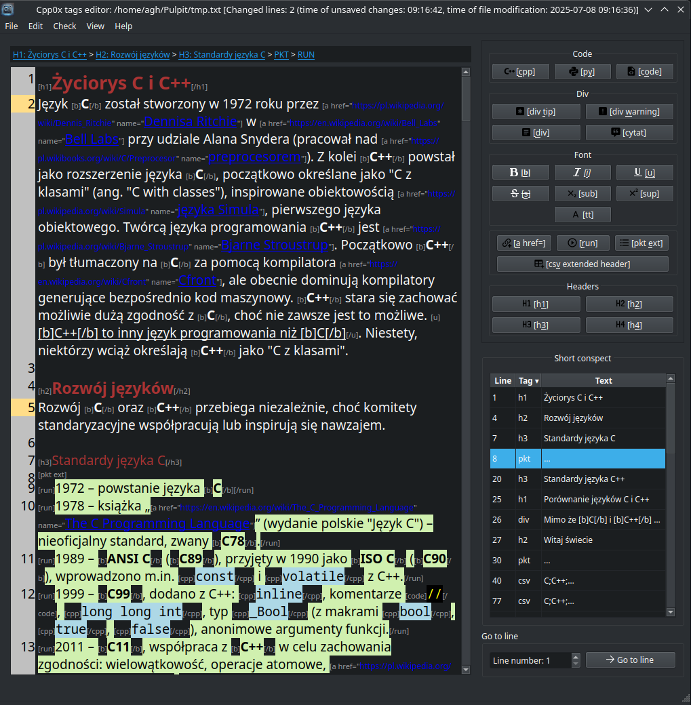

# Edytor STC

Prosty edytor tekstu stworzony w Qt, ułatwiający wstawianie znaczników [STC](https://cpp0x.pl/kursy/Kurs-STC/169) używanych na platformie [cpp0x.pl](https://cpp0x.pl/).

## Opis
Edytor ten został zaprojektowany, aby uprościć pracę z językiem znaczników STC na potrzeby tworzenia treści dla cpp0x.pl. Oferuje prosty interfejs oparty na Qt z polem tekstowym i przyciskami do wstawiania znaczników STC oraz dedykowane funkcje zwiększające produktywność.

## Dedykowane funkcje
 1. **Kolorowanie składni**: Podświetlanie znaczników STC dla lepszej czytelności.
 2. **Weryfikacja zamknięcia znaczników**: Sprawdza, czy wszystkie znaczniki STC są poprawnie zamknięte.
 3. **Transformacja tekstu**: Zmiana zaznaczonego tekstu na małe litery, wielkie litery, camelCase na snake_case lub odwrotnie.
 4. **Podgląd kontekstu dokumentu**:
    - Wykrywa znaczniki (np. `[h1]Nagłówek[/h1]`), ich numery linii oraz zawartość (np. „Nagłówek”).
    - Umożliwia przejście do określonych pozycji w dokumencie na podstawie kontekstu.
    - Filtrowanie wybranych znaczników (np. tylko `[h1]`).
    - Śledzenie pozycji kursora w kontekście dokumentu w czasie rzeczywistym.
 5. **Podgląd obrazów**: Najedź myszą na `[img src="ścieżka/do/obrazu.png"]`, aby zobaczyć podgląd obrazu (wymaga prawidłowej ścieżki).
 6. **Usuwanie znaczników**: Kliknij prawym przyciskiem wewnątrz znaczników (np. `[b]Pogrubiony tekst[/b]`), aby usunąć znaczniki, pozostawiając tylko treść (np. `Pogrubiony tekst`).
 7. **Formatowanie kodu C++**: Kliknij prawym przyciskiem wewnątrz `[cpp]...[/cpp]`, aby sformatować kod za pomocą `clang-format` (wymaga zainstalowanego `clang-format`).
 8. **Kompilacja kodu C++**: Kliknij prawym przyciskiem wewnątrz `[cpp]...[/cpp]`, aby skompilować kod za pomocą `g++` (wymaga zainstalowanego `g++`).
 9. **Statystyki pliku**: Wyświetla statystyki specyficzne dla STC, np. użycie znaczników, obok standardowych metryk edytora.
10. **Nawigacja okruszkowa**: Dynamicznie aktualizowany pasek adresu pokazujący bieżącą pozycję w strukturze dokumentu STC, z możliwością kliknięcia.
11. **Śledzenie zmian**: Śledzi zmienione linie za pomocą biblioteki pydifflib-cpp.
12. **Listowanie kodów w pliku**: Oddzielny widget, który śledzi na bieżąco pozycje kodów `[cpp]` i innych.
13. **Dedykowane przeciągnij i upuść**: Do aplikacji można przeciągać pliki i zostaną odpowiednio obsłużone:
    - Ścieżka do plików graficznych zostanie otoczona tagami `[img src="ścieżka/do/przeciagnietego/obrazu.png"]`
    - Zawartość plików tekstowych o rozszerzeniach wskazujących na C/C++ zostanie wstawione i otoczona tagami `[cpp]...[/cpp]`
    - Zawartość pozostałych plików tekstowych zostanie wstawiona i otoczona tagami `[code]...[/code]`
14. **Podgląd strony w czasie rzeczywistym**: Jest możliwe użycie w programie [backendu konwertującego kod ze znacznikami STC na kod HTML](https://cpp0x.pl/stc/).

## Ogólne funkcje edytora
Jeśli ktoś chce tego używać do innych celów:
 1. **Operacje na plikach**: Wczytywanie i zapisywanie plików z obsługą kodowania UTF-8.
 2. **Ostatnio otwarte pliki**: Zapamiętuje ostatnio używane pliki wraz z ostatnią pozycją w pliku dla szybkiego dostępu.
   - Zapamiętana jest również data ostatniego otwarcia pliku w edytorze. 
 3. **Wykrywanie zmian zewnętrznych**: Powiadamia o modyfikacjach pliku z zewnątrz.
 4. **Numerowanie linii**: Dodawanie numeracji do zaznaczonych linii przez menu kontekstowe (funkcja z menu kontekstowego).
 5. **Łączenie linii**: Łączenie wielu zaznaczonych linii w jedną, oddzieloną spacjami (funkcja z menu kontekstowego).
 6. **Kopiowanie ścieżki pliku**: Kopiowanie nazwy pliku lub pełnej ścieżki do schowka.
 7. **Kontrola wcięć**: `Tab` przesuwa zaznaczony tekst w prawo, `Shift+Tab` w lewo.
 8. **Lista skrótów**: Dostępna z menu aplikacji.
 9. **Wyszukiwanie tekstu**:
    - Wyszukiwanie z opcjami uwzględniania wielkości liter i dopasowania całych słów.
    - Wyświetlanie liczby wystąpień:
      - Z uwzględnieniem wielkości liter.
      - Bez uwzględniania wielkości liter.
      - Z uwzględnieniem wielkości liter, tylko całe słowa.
      - Bez uwzględniania wielkości liter, tylko całe słowa.
10. **Skalowanie czcionki**: Powiększanie/pomniejszanie czcionki za pomocą `Ctrl++` i `Ctrl+-` lub `Ctrl+MOUSE_SCROLL`.
11. **Pasek stanu**: Pokazuje liczbę niezapisanych zmienionych linii, czas ostatniej edycji i zapisu (tylko przy niezapisanych zmianach).
12. **Oznaczenie aktualnej linii**: Śledzenie aktualnej pozycji kursora klawiatury w ramach linijki

## Planowane funkcjonalności

### Przed pierwszym wydaniem

- **Naprawy**:
  - Naprawa problemu z pytaniem o nadpisywanie zmian, mimo ich braku, przy sekwencyjnym otwieraniu wielu plików.
- **Funkcje**:
- Śledzenie TODO w dokumencie.
- Wyszukaj i zamień: `Ctrl+R` z możliwością wyłączenia poszczególnych wykrytych pozycji.
  - Sprawdzania:
     - Sprawdzanie, czy znaczniki `[run]` znajdują się wewnątrz `[pkt]`.
     - Weryfikacja, czy wszystkie znaczniki są zamknięte (np. po opuszczeniu linijki sprawdzamy czy są tam zmiany, jak tak, to czy jest tam nowy tag)
     - Weryfikacja odpowiednich atrybutów w tagach (czy w cudzysłowiu, czy tylko dozwole atrubytu)
     - Weryfikacja czy wprowadzono tylko legalne tagi STC

### Pomysły na przyszłość

- Obsługa zakładek do szybkiego przechodzenia do miejsc w kodzie.
- Skróty `Alt+Lewo` i `Alt+Prawo` do nawigacji wstecz/dalej po pozycjach w kodzie.
- Otwieranie wielu plików jednocześnie.
- Widok sąsiadujący do porównywania plików.
- Eksport bloków kodu do osobnych plików.
- Konsolidacja obrazów do jednego katalogu z aktualizacją ścieżek w znacznikach STC.
- Integracja analizatora składni C++ (np. [flex](https://github.com/westes/flex)).
- Podświetlanie składni C++ i Pythona za pomocą [QCXXHighlighter](https://github.com/Megaxela/QCodeEditor) (licencja MIT).
- Kreator tabel dla znaczników STC.
- Wyświetlanie statystyk zmian w czasie rzeczywistym (dodane, zmodyfikowane, usunięte linie).
- Zamiana prefiksów adresów URL dla obrazów na serwerze.
- Historia wprowadzanych zmian (`Ctrl+Z`).
- Wyszukiwanie wielu słów w tej samej linii niezależnie od kolejności.
- Sprawdzanie pisowni po polsku (np. [nuspell](https://github.com/nuspell/nuspell) lub [spellchecker Qt](https://doc.qt.io/qt-6/qtwebengine-webenginewidgets-spellchecker-example.html)). https://forum.qt.io/topic/158878/check-spelling-in-qlineedit-and-qplaintextedit
- Obsługa różnych kodowań plików z automatycznym rozpoznawaniem.
- Obsługa wtyczek, być może z użyciem Lua.
- Integracja dokumentacji cppreference (jak w `cppman` lub QtCreator).
- Nagrywanie i odtwarzanie makr.
- Zastąpienie listy kontekstu widżetem drzewiastym.
- Dodanie ikon do akcji w menu i menu kontekstowym.
- Pokazywanie różnic w liniach znak po znaku.
- Optymalizacja wydajności edytora przy szybkim pisaniu.
- Dopasowanie rozmiaru numeracji linii do wielkości czcionki.
- Skanowanie dokumentu w osobnym wątku dla lepszej wydajności.
- Podświetlanie bieżącej linii dla lepszej widoczności kursora.
- Sensowne funkcjonalności z innych podobnych edytorów np. [Scribe-Text-Editor](https://github.com/AleksandrHovhannisyan/Scribe-Text-Editor)
- Ctrl + F gdy mamy focus w dokumencie powinno zyskać focus, a nie zniknąć
- Sprawdzenie czy link istnieje
- Następna zmiana - przycisk pozwalający skakać po zmianach w dokumencie
- chowanie breadcrumb
- enter na wyszukiwaniu skacze do miejsca wykrycia
    - SHIFT N - kolejne wykrycie i też trzeba by wymyślić poprzednie
- Dodać check: czy nie zamykam nieotwartego tagu?
- Sprawdzenie czy Run nie jest poza csv lub pkt
- Refaktoring: Jeśli wczytywanie pliku jest przez CodeEditor, to zapis pliku też konsekwentnie powinien stamtąd iść
- Tłumaczenia aplikacji na wiele języków: QLinguist
- Rozważyć użycie innej biblioteki do porównywania np. https://github.com/google/diff-match-patch
- Szukanie tylko w kodzie
- Przeciągnij i upuść pliku z kodem
- Formatowanie kodu C++ dedykowane
- W linijce gradient ostatnio używanych linii z numerami ile temu
- Przy CTRL + SCROLL wyświetlanie informacji o rozmiarze czcionki (jak QtCreator)
- Ukrycie tagów, nie licząc otaczających (rich text editor)
- Przycisk na sformatowanym tekście powinien usunąć dane formatowanie - np. jak klikniemy CTRL+B na pogrubionym to aby nie był pogrubiony
- Wyszukiwanie tekstu może też oznaczyć szukany tekst w dokumencie np. ramką
- Kontekst trzeba by uprościć, aby zawierał tylko nagłówki (domyślnie)
- Historia zmian w linii
- Precompiled headers dla codeEditor.h i moduły
- IWYU podpiąć pod CMake'a
- Zwijanie nagłówków i kodu (jak funkcje w środowiskach programistycznych)
- Automatyczne backupy treści
- Do formatowania znajduje plik `clang-format`, który jest w aktualnym katalogu (obok pliku, który edytujemy)
- Klikanie na linku Ctrl + click - otwieranie linka
- Kurs STC wbudowany w program
- Prawy przycisk myszy na: tagach `img`, `a href`, `pkt`, `csv` powinien dawać możliwość dodania/usunięcia atrybutów
- Śledzenie pozycji między pozycją w dokumencie źródłowym a podglądem HTML

## Współpraca

Zapraszam do współpracy! Propozycje zmian i pull requesty są mile widziane, aby uczynić ten edytor jeszcze bardziej użytecznym.

### Znalezione bugi
Bardzo proszę o dokładne informacje jakie to bugi, czyli:
1. W jakiej sytuacji (Sekwencja kroków)
2. Kod STC, który to spowodował
3. Jakie jest oczekiwane zachowanie wg Ciebie?

## Przydatność

Narzędzie to okazało się bardzo pomocne przy tworzeniu artykułów na cpp0x.pl, np. [porównującym python i C++](https://cpp0x.pl/artykuly/Inne-artykuly/Porownanie-C++-i-Python-roznice-w-skladni-i-podejsciu-programistycznym/99). Ułatwia wstawianie znaczników STC i debugowanie niezamkniętych znaczników.

## Przydatne linki

- [Interpreter STC on-line](https://cpp0x.pl/stc/)
- [Źródło użytych ikonek: MDI](https://pictogrammers.com/library/mdi/)

## Ostrzeżenie

Edytor jest prostym narzędziem i nie został gruntownie przetestowany pod kątem niezawodności. Używaj go na własne ryzyko, ponieważ może nie zachować ważnych treści. Jak dotąd jednak nie zawiódł autora.
