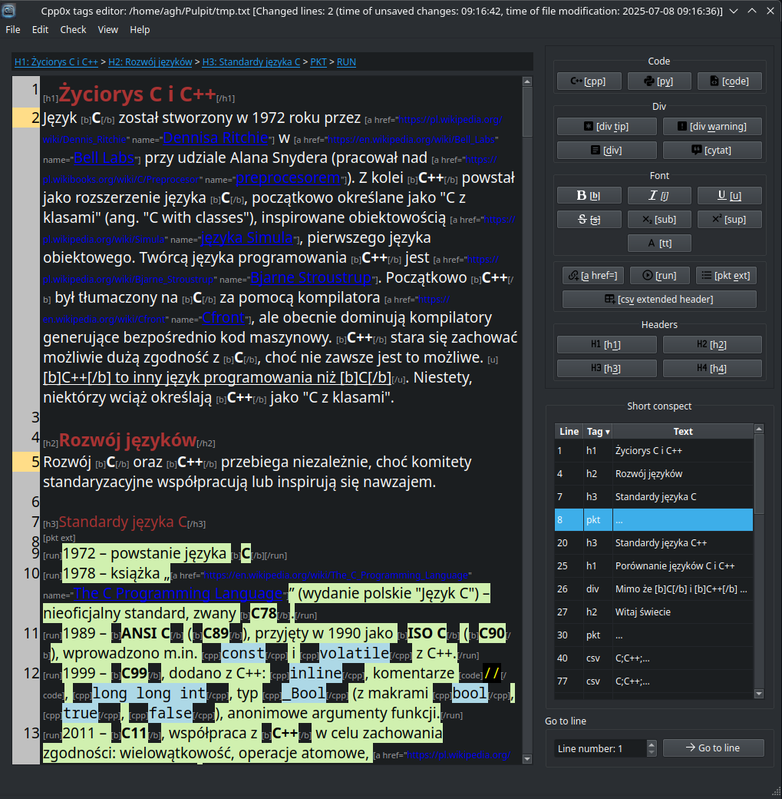

# Edytor STC

Prosty edytor tekstu stworzony w Qt, ułatwiający wstawianie znaczników [STC](https://cpp0x.pl/kursy/Kurs-STC/169) używanych na platformie [Cpp0x.pl](https://cpp0x.pl/).

## Opis
Edytor ten został zaprojektowany, aby uprościć pracę z językiem znaczników STC na potrzeby tworzenia treści dla [cpp0x.pl](https://cpp0x.pl/). Oferuje prosty interfejs oparty na Qt z polem tekstowym i przyciskami do wstawiania znaczników STC oraz dedykowane funkcje zwiększające produktywność.

## Dedykowane funkcje
Jak ktoś chce tego używać na potrzeby pisania na stronę [Cpp0x.pl](https://cpp0x.pl/) (do czego zachęcam):
 1. **Kolorowanie składni**: Podświetlanie znaczników STC dla lepszej czytelności.
    - Kolorowanie składni C++ w ramach znaczników `[cpp]...[/cpp]`. Jest to zaimplementowane przy wykorzystaniu [QCodeEditor](https://github.com/Megaxela/QCodeEditor) (autorstwa [Megaxela](https://github.com/Megaxela), bazując na [forku ArsMasiuk](https://github.com/ArsMasiuk/QCodeEditor)).
 2. **Weryfikacja zamknięcia znaczników**: Sprawdza, czy wszystkie znaczniki STC są poprawnie zamknięte.
 3. **Transformacja tekstu**: Zmiana zaznaczonego tekstu na małe litery, wielkie litery, camelCase na snake_case lub odwrotnie.
 4. **Podgląd kontekstu dokumentu**:
    - Wykrywa znaczniki (np. `[h1]Nagłówek[/h1]`), ich numery linii oraz zawartość (np. „Nagłówek”).
    - Umożliwia przejście do określonych pozycji w dokumencie na podstawie kontekstu.
    - Filtrowanie wybranych znaczników (np. tylko `[h1]`).
    - Śledzenie pozycji kursora w kontekście dokumentu w czasie rzeczywistym.
 5. **Podgląd obrazów**: Najedź myszą na `[img src="ścieżka/do/obrazu.png"]`, aby zobaczyć podgląd obrazu (wymaga prawidłowej ścieżki).
    - Podgląd również obrazków z internetu
 6. **Usuwanie znaczników**: Kliknij prawym przyciskiem wewnątrz znaczników (np. `[b]Pogrubiony tekst[/b]`), aby usunąć znaczniki, pozostawiając tylko treść (np. `Pogrubiony tekst`).
 7. **Formatowanie kodu C++**: Kliknij prawym przyciskiem wewnątrz `[cpp]...[/cpp]`, aby sformatować kod za pomocą `clang-format` (wymaga zainstalowanego `clang-format`).
    - Jeśli obok pliku tekstowego znajduje się plik z ustawieniami formatowania ".clang-format" to zostanie on użyty, w przeciwny wypadku domyślne użyte zostanie "LLVM".
 8. **Kompilacja kodu C++**: Kliknij prawym przyciskiem wewnątrz `[cpp]...[/cpp]`, aby skompilować kod za pomocą `g++` (wymaga zainstalowanego `g++`).
 9. **Usuwanie komentarzy C++**: Kliknij prawym przyciskiem wewnątrz `[cpp]...[/cpp]`, aby usunąć wszystkie komentarze z kodu C++ (wykorzystuje bibliotekę [StripCppComments](https://github.com/wtwhite/StripCppComments)). Dodatkowo funkcja czyści nadmiarowe puste linie, pozostawiając maksymalnie dwie puste linie obok siebie.
10. **Czyszczenie pustych linii**: Kliknij prawym przyciskiem wewnątrz dowolnego tekstu, aby usunąć nadmiarowe puste linie, pozostawiając maksymalnie dwie puste linie obok siebie. Przydatne do porządkowania tekstu po usunięciu komentarzy lub ogólnego czyszczenia formatowania.
 9. **Statystyki pliku**: Wyświetla statystyki specyficzne dla STC, np. użycie znaczników, obok standardowych metryk edytora.
10. **Nawigacja okruszkowa**: Dynamicznie aktualizowany pasek adresu pokazujący bieżącą pozycję w strukturze dokumentu STC, z możliwością kliknięcia.
11. **Śledzenie zmian**: Śledzi zmienione linie za pomocą biblioteki pydifflib-cpp.
12. **Listowanie kodów w pliku**: Oddzielny widget, który śledzi na bieżąco pozycje kodów `[cpp]` i innych.
13. **Dedykowane przeciągnij i upuść**: Do aplikacji można przeciągać pliki i zostaną odpowiednio obsłużone:
    - Ścieżka do plików graficznych zostanie otoczona tagami `[img src="ścieżka/do/przeciagnietego/obrazu.png"]`
    - Zawartość plików tekstowych o rozszerzeniach wskazujących na C/C++ zostanie wstawione i otoczona tagami `[cpp]...[/cpp]`
    - Zawartość pozostałych plików tekstowych zostanie wstawiona i otoczona tagami `[code]...[/code]`
14. **Podgląd strony w czasie rzeczywistym**: Jest możliwe użycie w programie [backendu konwertującego kod ze znacznikami STC na kod HTML](https://cpp0x.pl/stc/).
    - Dostępne są również statystyki: ile danych wysłano i pobrano, widoczne po najechaniu myszką na obszar renderujący
15. **Śledzenie TODO w dokumencie**: W podglądzie dokumentu widać komentarze `TODO: ` wraz z tekstem na prawo od tego, są one klikalne i wtedy przechodzą do danej pozycji.
16. **Klikalne linki**: wewnątrz tagów z linkiem `[a href="..."]` lub `[a href="..." name="..."]` możemy przytrzymać CTRL + lewy przycisk myszy i nam się otworzy dany link
17. **Wklejane linki wklejane w odpowiedni sposób**: jak wklejamy przez CTRL+V, a w schowku jest link to otacza linka tagami linka `[a href="link"]`
    - Po chwili zostanie pobrana z linka i dodana jako kolejny atrybut nazwa strony, czyli zamiast `[a href="link"]` będzie `[a href="link" name="Nazwa strony dla linka"]`
    - Jeśli jest zaznaczony tekst to "podlinkowuje go" przez otoczenie: `[a href="link" name="Zaznaczony wcześniej tekst"]`
    - Jeśli wklejamy linka wewnątrz tagu `[img src=""]` to jest wklejany jako zwykły tekst.
18. **Wklejalne tabelki**: gdy w schowku jest tabelka to jest ona otaczana odpowiednimi tagami `[csv]...[/csv]` a komórki są rozdzielane średnikami.
    - Jeśli wklejony tekst zawiera tagi, to odpowiednie komórki są otaczane przez `[run]`, a typ tabelki się zmienia na `[csv ext]`
19. **Wklejanie rich-text**: jak wkleimy tekst ze strony lub np. programu Office to HTML jest zamieniany na znaczniki STC (częściowo), m.in. linki, pogrubienia itp.
20. **Dodawanie/usuwanie atrybutów dla tagów z menu kontekstowego**: Gdy klikniemy prawym przyciskiem myszy na tagu, które ma możliwe różne atrybuty, to pojawia się możliwość wyklikania opcjonalnych atrybutów do dodania/usunięcia.
21. **Przyciski do dodawania tagów STC (inteligentne przyciski)**: Obok tekstu są różne przyciski wspierające prawie wszystkie tagi STC. Kliknięcie przycisku powoduje albo wstawienie tagu w pozycji kursora tekstu, albo otoczenie zaznaczonego tekstu tagami.
    - Przycisk `a href` dostosowuje się do zaznaczonego tekstu, jak go nie ma to po prostu wstawia pusty tag, ale jak coś jest zaznaczone to próbuje wykryć tam link i odpowiednio otoczyć tagiem dopasowując zarówno linka jak i nazwę linka
    - Przycisk `img` dostosowuje się do zaznaczonego tekstu, jak go nie ma to po prostu wstawia pusty tag, ale jak coś jest zaznaczone to próbuje wykryć ścieżkę do pliku graficznego i odpowiednio otoczyć tagiem dopasowując zarówno źródło obrazka jak i opis
    - Niektóre tagi mają inteligentne zaznaczenie np. jak mamy zaznaczony link i tekst, a chcemy otoczyć przez `[a href=...]` to link wstawi w miejsce odnośnika a resztę tekstu jako nazwę linka.
    - Podobnie jest z zaznaczeniem tekstu zawierającego ścieżkę do obrazka, a chcemy otoczyć przez `[img src...]` to wtedy nazwa obrazka stanowi jego adres, a reszta zaznaczonego tekstu jego opis.
    - Gdy mamy zaznaczony tekst, który jest już otagowany i wywołujemy ponowne tagowanie tego tekstu tymi samymi tagami to jeśli jest zaznaczony tekst z tagami lub wewnatrz tagów to zostaną te tagi usunięte.
22. **Sprawdzanie literówek** (ang. spellcheck): teksty jest sprawdzany ze słownikiem (biblioteka [nuspell](https://nuspell.github.io/)), oraz są podkreślane nieistniejące wyrazy w języku polskim. Oczywiście w ramach tagów STC tekst jest pomijany (chyba, że atrybuty wymagające sprawdzenia, np. opis obrazka).
    - Menu kontekstowe z podpowiedziamy poprawiającymi literówki.
23. **Inteligentne menu kontekstowe dla tagów**: Po kliknięciu w tekście prawym przyciskiem myszy na tagu pojawiają się pewne specyficzne, dla danego tagu funkcjonalności:
    - Po kliknięciu w ramach `[a href=...]` pojawiają się akcje do obsługi linka
24. **Wizualny edytor tabel STC**: Po kliknięciu PPM na `[csv...]` pojawia się opcja edycji tabeli. Dzięki temu pojawia się wizualne okno, w którym możemy edytować tabelę.
    - Jest również możliwość drag&drop między komórkami powodująca ich zamianę
25. **Wyszukiwanie na [Cppreference](cppreference.com) po słowach kluczowych z kodu C++**: jak w ramach tagów `[cpp]...[/cpp]` klikniemy PPM na słowie to w menu kontekstowym pojawia się opcja wyszukiwania, po jej naciśnięciu pojawia się nam okno z cppreference dla danego hasła.
26. **Otwieranie opisu tagów STC**: jak klikniemy PPM na dowolnym tagu otwierającym STC to pojawia się opcja w menu kontekstowym, której wybranie powoduje otwarcie podstrony [kursu STC](https://cpp0x.pl/kursy/Kurs-STC/169) zawierającej ten tag.

## Ogólne funkcje edytora
Edytor też nadaje sie do innych celów - do ogólnej edycji dokumentu, oto wybrane funkcjonalności, których brakuje mi w zwykłych edytorach:
 1. **Operacje na plikach**: Wczytywanie, zapisywanie i przeładowanie pliku. Również zmiana nazwy otwartego pliku.
 2. **Ostatnio otwarte pliki**: Zapamiętuje ostatnio używan\e pliki wraz z ostatnią pozycją w pliku dla szybkiego dostępu.
    - Zapamiętana jest również data ostatniego otwarcia pliku w edytorze. 
 3. **Wykrywanie zmian zewnętrznych**: Powiadamia o modyfikacjach pliku z zewnątrz.
 4. **Inteligentne menu kontekstowe dla tekstu**, m.in.:
    - **Numerowanie linii**: Dodawanie numeracji do zaznaczonych linii przez menu kontekstowe (funkcja z menu kontekstowego). Również usuwanie numerów z linii.
        - Poprawa numeracji dokumentu (gdy pewnych liczb brakuje, lub są zdublowane).
    - **Dodawania punktów do każdej linii zaznaczonego tekstu**:
    - **Sortowanie zaznaczonych linijek**: z pominięciem wielkości znaków
    - **Łączenie linii**: Łączenie wielu zaznaczonych linii w jedną, oddzieloną spacjami (funkcja z menu kontekstowego).
    - **Konwersje między wielkością znaków zaznaczonego tekstu**: na małe, na duże, CamelCase <-> snake_case
 5. **Kopiowanie ścieżki pliku**: Kopiowanie nazwy pliku lub pełnej ścieżki do schowka.
 6. **Kontrola wcięć**: `Tab` przesuwa zaznaczony tekst w prawo, `Shift+Tab` w lewo.
 7. **Lista skrótów**: Dostępna z menu aplikacji.
 8. **Wyszukiwanie tekstu**:
    - Wyszukiwanie z opcjami uwzględniania wielkości liter i dopasowania całych słów.
    - Wyświetlanie liczby wystąpień:
      - Z uwzględnieniem wielkości liter.
      - Bez uwzględniania wielkości liter.
      - Z uwzględnieniem wielkości liter, tylko całe słowa.
      - Bez uwzględniania wielkości liter, tylko całe słowa.
    - ENTER i SHIFT+ENTER odpowiednio przesuwają do kolejnego/poprzedniego wystąpienia z tabeli
    - Strzałki dół/góra dzialają jak powyższe, ale nie przeskakują z focusem do edytora tekstu
    - Wyszukiwania podświetlają wszystkie wystąpienia w tekście
    - `Ctrl+R` włącza tryb zamiany: każde znalezione miejsce ma checkbox, dzięki czemu można wybrać dokładnie te wystąpienia, które mają zostać zmienione.
    - Opcja **Skip already replaced** pomija wyniki będące już częścią tekstu zastępującego, np. nie zamieni `cout` wewnątrz `std::cout`.
 9. **Skalowanie czcionki**: Powiększanie/pomniejszanie czcionki za pomocą `Ctrl++` i `Ctrl+-` lub `Ctrl+MOUSE_SCROLL`.
10. **Pasek stanu**: Pokazuje nazwę otwartego pliku, ale też liczbę niezapisanych zmienionych linii, czas ostatniej edycji i zapisu (tylko przy niezapisanych zmianach).
11. **Oznaczenie aktualnej linii**: Śledzenie aktualnej pozycji kursora klawiatury w ramach linijki
12. **Szczegółowy wykaz niezapisanych zmian**: Gdy mamy niezapisane zmiany i próbujemy wyjść z programu to poza spytaniem użytkownika czy na pewno chce wyjść bez zapisania zmian pojawia się od razu diff w formie tabeli pokazujący różnice w odpowiadających sobie liniach.
    - Możliwść przywrócenia zmian względem danej linii z dysku.
    - Zmiany mają również pokazane różnicę w numerach poszczególnych znaków, wtedy możemy lepiej odróżnić znaki, które "na oko" są takie same.
13. **Ukrywalne widgety**: wszystko poza edytorem tekstu można ukryć, dzięki temu pewne funkcje są wyłączone i edytowanie działa szybciej.
14. **Obsługa różnych kodowań pliku tekstowego**: Nie tylko UTF-8. Jest to dzięki bibliotece [uchardet](https://gitlab.freedesktop.org/uchardet/uchardet).
15. **Stoper pracy**: stoper, który odpala się po uruchomieniu edytora i liczy zarówno czas kiedy edytor jest włączony, jak i czas pracy w edytorze (wykrywa naciśnięcia klawiszy, gdy ich długo nie ma to się zatrzymuje)

## ⬇️ Pobieranie (najnowsza wersja zbudowana automatycznie)

Możesz pobrać najnowszą skompilowaną wersję **STC_editor**, z ostatniego poprawnie zakończonego procesu budowania przez GitHub Actions (wymagane konto na Github - tak oni wymyślili):

👉 [⬇️ Pobierz wersję skompilowaną w formacie AppImage (działa na systemie Linux)](https://github.com/baziorek/STC_editor/actions/workflows/release-ubuntu22.04.yml?query=branch%3Amaster)
👉 [⬇️ Pobierz wersję skompilowaną na Windowsa](https://github.com/baziorek/STC_editor/actions/workflows/release-windows.yml?query=branch%3Amaster)

> Po przejściu pod powyższy link:
> 1. Kliknij na najnowsze zakończone zadanie (workflow).
> 2. Przewiń stronę na dół.
> 3. Pobierz artefakt o nazwie `STC_editor-x86_64.AppImage` lub `STC_editor-win64.zip`

📦 [⬇️ Pobierz najnowszą wersję release](https://github.com/baziorek/STC_editor/releases/latest)  
*Aktualnie brak opublikowanych wydań (release). Gdy się pojawią — będą dostępne tutaj.*

## Planowane funkcjonalności

1. Bug: po uruchomieniu artykułu nie znajduje TODOsów
2. MiniBug: Niewidoczny tekst gdy aktywna linia w trybie nie-ciemnym.
3. Wyszukiwanie wielu słów w tej samej linii niezależnie od kolejności.
4. Pobieranie aktualizacji przez https://cpp0x.pl/xml/
5. Dodać zapamiętywanie loginu i hasła, ewentualnie cookie-from-browser aby nie podawać za każdym razem loginu i hasła.
6. Integracja analizatora składni C++ (np. [flex](https://github.com/westes/flex)).
7. Podświetlanie składni Pythona za pomocą [QCXXHighlighter](https://github.com/Megaxela/QCodeEditor) (licencja MIT).
8. Obsługa różnych kolorowań składni (różne typy plików, bazujące na QCodeEditor).
9. Wyświetlanie statystyk zmian w czasie rzeczywistym (liczba linii, znaków, rozmiar pliku, linia i kolumna).
10. Historia wprowadzanych zmian (`Ctrl+Z`).
11. Szybsze wyjście z aplikacji - po prostu wyjście, bez przywracania stanu niewymagającego zapisu
12. Integracja dokumentacji cppreference (jak w `cppman` lub QtCreator).
13. FindWidget - aby aktualizował pozycje w tekście na bieżąco przy dodawaniu/usuwaniu linii.
14. Szukanie tylko w kodzie
15. Może AI mi podzieli CodeEditor aby nie był GodObject
16. Ctrl + V gdy mamy obrazek w schowku - wtedy powinno zaproponować umieszczenie obrazka w odpowiednim katalogu
17. Tłumaczenia aplikacji na wiele języków: QLinguist
18. Rozważyć użycie tej samej biblioteki do porównywania zarówno linii jak i znaków np. https://github.com/google/diff-match-patch
19. Podpięcie sztucznej inteligencji np. [Ollama](https://ollama.com)
20. Przy CTRL + SCROLL wyświetlanie informacji o rozmiarze czcionki (jak QtCreator)
21. Kreator tabel dla znaczników STC.
22. PreviewWidget: Śledzenie pozycji między pozycją w dokumencie źródłowym a podglądem HTML
23. Historia zmian w linii
24. Precompiled headers dla CodeEditor.h i moduły
25. IWYU podpiąć pod CMake'a
26. Zwijanie nagłówków i kodu (jak funkcje w środowiskach programistycznych)
27. Automatyczne backupy treści
28. W danej linii da się wpisać dane np.: `QTextBlockUserData` i potem `block.setUserData(data);` - może da się to wykorzystać w optymalizacji
29. Optymalizacja wydajności edytora przy szybkim pisaniu.
30. Podgląd terminala np. przez https://github.com/lxqt/qtermwidget - tylko czy mi to nie zrobi GPLa?
31. Zastąpienie listy kontekstu widżetem drzewiastym.
32. W linijce gradient ostatnio używanych linii z numerami ile temu
33. Ukrycie tagów, nie licząc otaczających (rich text editor)
34. Możliwość wyłączenia poszczególnych aspektów kolorowania składni.
35. Następna/poprzednia zmiana: przycisk pozwalający skakać po zmianach w dokumencie
36. Sensowne funkcjonalności z innych podobnych edytorów np. [Scribe-Text-Editor](https://github.com/AleksandrHovhannisyan/Scribe-Text-Editor)
37. Podgląd strony internetowej po najechaniu myszką
38. Wsparcie dla MD na bazie: https://github.com/Qt-Widgets/notes
39. Inne widgety np. https://github.com/Qt-Widgets/SlidingStackedWidget-1 z listy: https://github.com/Qt-Widgets/ lub https://qwt.sourceforge.io/index.html
40. Skanowanie dokumentu w osobnym wątku dla lepszej wydajności.
41. Nagrywanie i odtwarzanie makr.
42. Obsługa wtyczek, być może z użyciem Lua.
43. Zamiana prefiksów adresów URL dla obrazów na serwerze.
44. Dyktowanie tekstu (biblioteka [Whisper](https://github.com/openai/whisper))
45. Skróty `Alt+Lewo` i `Alt+Prawo` do nawigacji wstecz/dalej po pozycjach w kodzie.
46. Otwieranie wielu plików jednocześnie.
47. Widok sąsiadujący do porównywania plików.
48. Eksport bloków kodu do osobnych plików.
49. Konsolidacja obrazów do jednego katalogu z aktualizacją ścieżek w znacznikach STC.
50. Przy porównywaniu difa niezapisanych zmian z zawartością pliku (linijka w linijkę): możliwość zapisania na dysk poszczególnych linii.
51. Gdy zewnętrzne zmiany w pliku to powinno też pokazać diffa.
52. Gdy wyświetlamy diffa, ale linie są długie to pojawia się scrolling area, a nie powinna.
53. Rezultat komendy w edytorze.
54. Sprawdzania:
     - Sprawdzanie, czy znaczniki `[run]` znajdują się wewnątrz `[pkt]`.
     - Weryfikacja, czy wszystkie znaczniki są zamknięte (np. po opuszczeniu linijki sprawdzamy czy są tam zmiany, jak tak, to czy jest tam nowy tag)
     - Weryfikacja odpowiednich atrybutów w tagach (czy w cudzysłowiu, czy tylko dozwole atrubytu)
     - Weryfikacja czy wprowadzono tylko legalne tagi STC
     - Sprawdzenie czy link istnieje
     - Dodać check: czy nie zamykam nieotwartego tagu?
     - Sprawdzenie czy Run nie jest poza csv lub pkt
55. Blokowanie pliku, który się edytuje.
56. A może do szukania błędów (niezamkniętych tagów) zaprzędz analizator składniowy: https://www.antlr.org/ ?

## Min Bugi (czyli wcale nie trzebaich poprawiać):
1. Dopasowanie rozmiaru numeracji linii do wielkości czcionki.
2. MiniBug: funkcjonalność zmiany wielkości czcionki zakłóca nowe tagi. Jak powiększymy czcionkę i potem dodamy coś np. H1, to on będzie miał czcionkę nawet mniejszą niż reszta, mimo iż to nagłówek
3. Zmiana wielkości czcionki powinna też wpłynąć na czcionkę w ramach numeracji linii
4. Usuwanie całych linii z pliku nie zmienia tytułu okna: jak dodajemy linie lub coś zmieniamy to w tytule okna pokazuje ile linii zmieniono, jednakże gdy linie są usuwaneto nie pokazuje. Trzeba by zmienić sposób wykrywania zmian przez bibliotekę, a następnie zmienić generowany tytuł.

## Współpraca

Zapraszam do współpracy! Propozycje zmian i pull requesty są mile widziane, aby uczynić ten edytor jeszcze bardziej użytecznym.

### Znalezione bugi?
Bardzo proszę o dokładne informacje jakie to bugi, czyli:
1. W jakiej sytuacji (Sekwencja kroków)
2. Kod STC, który to spowodował
3. Jakie jest oczekiwane zachowanie wg Ciebie?

## Przydatność

Narzędzie to okazało się bardzo pomocne przy tworzeniu artykułów na [Cpp0x.pl](https://cpp0x.pl/), np. [porównującym python i C++](https://cpp0x.pl/artykuly/Inne-artykuly/Porownanie-C++-i-Python-roznice-w-skladni-i-podejsciu-programistycznym/99). Ułatwia wstawianie znaczników STC i debugowanie niezamkniętych znaczników.

## Przydatne linki

- [Interpreter STC on-line](https://cpp0x.pl/stc/)
- [Źródło użytych ikonek: MDI](https://pictogrammers.com/library/mdi/)

## Używane biblioteki zewnętrzne
1. [pydifflib-cpp](https://github.com/dominicprice/pydifflib-cpp) - Do śledzenia zmian w liniach. Licencja: BSD 3-Clause.
2. [diff-match-patch-cpp-stl](https://github.com/leutloff/diff-match-patch-cpp-stl/) - Do różnic na poziomie znaków w obrębie linii. Licencja: Apache 2.0.
3. [uchardet](https://gitlab.freedesktop.org/uchardet/uchardet) - Do wykrywania kodowania plików (nie tylko UTF-8). Licencja: Mozilla Public License.
4. [nuspell](https://nuspell.github.io/) - Do sprawdzania pisowni, wykorzystuje słowniki [Hunspell](https://hunspell.github.io/).
5. [StripCppComments](https://github.com/wtwhite/StripCppComments) - Do usuwania komentarzy z kodu C++. Licencja: MIT.
6. [ArsMasiuk/QCodeEditor](https://github.com/ArsMasiuk/QCodeEditor) (będący forkiem [Megaxela/QCodeEditor](https://github.com/Megaxela/QCodeEditor)) - edytor tekstowy w Qt, który ma kolorowanie składni dla C++, Python i innych. Licencja MIT.

### Słowniki (język polski)

Aplikacja wykorzystuje [słowniki](https://github.com/nuspell/nuspell/wiki/Dictionaries-and-Contacts) [Hunspell](https://hunspell.github.io/) ([pl_PL.aff](https://cgit.freedesktop.org/libreoffice/dictionaries/plain/pl_PL/pl_PL.aff), [pl_PL.dic](https://cgit.freedesktop.org/libreoffice/dictionaries/plain/pl_PL/pl_PL.dic)) udostępnione w ramach projektu LibreOffice.

Słowniki te są objęte licencją [Mozilla Public License v2.0 (MPL-2.0)](https://www.mozilla.org/MPL/2.0/).  
Oryginalne źródła pobrane z [repozytoriów libreoffice](https://cgit.freedesktop.org/libreoffice/dictionaries/tree/pl_PL)

Autorzy i szczegóły licencji znajdują się w plikach:
- [README_pl.txt](dictionaries/pl/README_pl.txt)
- [README_en.txt](dictionaries/pl/README_en.txt)

## Ostrzeżenie

Edytor jest prostym narzędziem i nie został gruntownie przetestowany pod kątem niezawodności. Używaj go na własne ryzyko, ponieważ może nie zachować ważnych treści. Jak dotąd jednak nie zawiódł autora.
